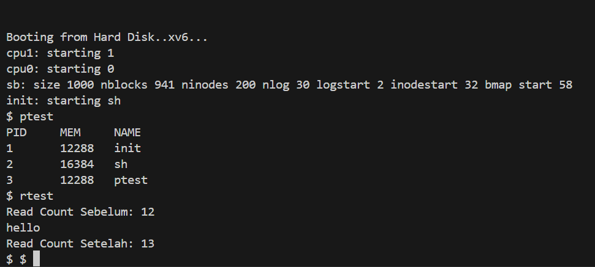

# 📝 Laporan Tugas Akhir

**Mata Kuliah**: Sistem Operasi
**Semester**: Genap / Tahun Ajaran 2024–2025
**Nama**: Radika Rismawati Tri Prasaja
**NIM**: 240202905
**Modul yang Dikerjakan**:
`(Modul 1 – System Call dan Instrumentasi Kernel)`

---

# 📌 Deskripsi Singkat Tugas

**Modul 1 – System Call dan Instrumentasi Kernel**  
Menambahkan dua system call baru:

1. `getpinfo()` – untuk melihat daftar proses yang aktif, termasuk PID, ukuran memori, dan nama proses.  
2. `getReadCount()` – untuk menghitung berapa kali system call `read()` dipanggil sejak sistem boot.

---

# 🛠️ Rincian Implementasi

* Menambahkan dua system call baru:
  - Implementasi `sys_getpinfo` di `sysproc.c`
  - Implementasi `sys_getReadCount` di `sysfile.c`
* Menambahkan deklarasi di:
  - `syscall.h` – mendefinisikan syscall numbers baru
  - `user.h` – deklarasi fungsi syscall agar bisa dipanggil user-space
  - `usys.S` – makro SYSCALL untuk dua fungsi baru
* Menambahkan struktur `struct pinfo` di `proc.h` untuk menyimpan daftar proses.
* Menambahkan counter global `readcount` di kernel
* Menambahkan locking menggunakan `spinlock` untuk mengakses ptable secara aman
* Program uji:
  - `ptest.c` – mencetak informasi proses aktif (menguji `getpinfo()`)
  - `rtest.c` – mencetak `readcount` sebelum dan sesudah melakukan `read()`, menguji `getReadCount()`

---

# ✅ Uji Fungsionalitas

Program uji yang digunakan:

* `ptest` → mencetak informasi proses menggunakan `getpinfo()`
* `rtest` → menampilkan jumlah pemanggilan `read()` sebelum dan sesudah membaca input

---

# 📷 Hasil Uji

### 📍 Output `ptest`:
```
PID     MEM     NAME
1       12288   init
2       16384   sh
3       12288   ptest
```

### 📍 Output `rtest`:
```
Read Count Sebelum: 12
hello
Read Count Setelah: 13
```

📸 Screenshot hasil uji:


---

# ⚠️ Kendala yang Dihadapi

* **Error saat implementasi awal `sys_getpinfo`** karena lupa `#include "spinlock.h"`  
  ➜ Solusi: tambahkan `#include "spinlock.h"` di `sysproc.c`
* **Error saat mengakses `ptable` di `sysproc.c`**  
  ➜ Solusi: deklarasikan ulang `extern struct { ... } ptable` di bagian atas `sysproc.c`
* **`readcount` tidak dikenali di `sysfile.c`**  
  ➜ Solusi: tambahkan `extern int readcount;` di atas fungsi `sys_read`

---

# 📚 Referensi

* Buku xv6 MIT: [https://pdos.csail.mit.edu/6.828/2018/xv6/book-rev11.pdf](https://pdos.csail.mit.edu/6.828/2018/xv6/book-rev11.pdf)
* Repositori xv6-public: [https://github.com/mit-pdos/xv6-public](https://github.com/mit-pdos/xv6-public)

