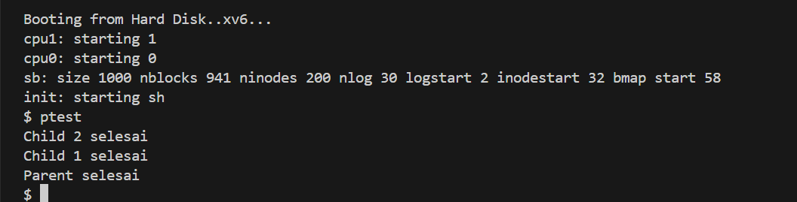

# 📝 Laporan Tugas Akhir

**Mata Kuliah**: Sistem Operasi
**Semester**: Genap / Tahun Ajaran 2024–2025
**Nama**: Radika Rismawati Tri Prasaja
**NIM**: 240202905
**Modul yang Dikerjakan**:
# 🧪 Modul 2 — Penjadwalan CPU Lanjutan (Priority Scheduling Non-Preemptive)

## 🎯 Tujuan

Mengubah algoritma penjadwalan proses di `xv6-public` dari **Round Robin** menjadi **Non-Preemptive Priority Scheduling**, dengan:

* Menambahkan field `priority` pada setiap proses
* Menambahkan syscall `set_priority(int)` untuk mengatur prioritas proses
* Memodifikasi scheduler agar selalu menjalankan proses RUNNABLE dengan prioritas tertinggi

---

## 🗂️ File yang Diubah

| File        | Perubahan                                     |
| ----------- | --------------------------------------------- |
| `proc.h`    | Tambahkan field `priority` ke struct proc     |
| `proc.c`    | Modifikasi fungsi `scheduler()`               |
| `sysproc.c` | Tambahkan implementasi syscall `set_priority` |
| `syscall.h` | Tambahkan nomor syscall                       |
| `syscall.c` | Registrasikan syscall                         |
| `user.h`    | Deklarasi syscall                             |
| `usys.S`    | Entri syscall                                 |
| `Makefile`  | Tambah program uji `ptest.c`                  |

---

## 🧩 Rincian Implementasi

### 🔹 1. Tambahkan `priority` ke `struct proc`

```c
int priority; // nilai prioritas (0 = tertinggi, 100 = terendah)
```

### 🔹 2. Inisialisasi `priority` di `allocproc()`

```c
p->priority = 60; // nilai default
```

### 🔹 3. Implementasi syscall `set_priority(int)`

#### a. `syscall.h`
```c
#define SYS_set_priority 24
```

#### b. `user.h`
```c
int set_priority(int priority);
```

#### c. `usys.S`
```asm
SYSCALL(set_priority)
```

#### d. `syscall.c`
```c
extern int sys_set_priority(void);
[SYS_set_priority] sys_set_priority,
```

#### e. `sysproc.c`
```c
int sys_set_priority(void) {
  int prio;
  if (argint(0, &prio) < 0 || prio < 0 || prio > 100)
    return -1;
  myproc()->priority = prio;
  return 0;
}
```

### 🔹 4. Modifikasi scheduler di `proc.c`

```c
void scheduler(void) {
  struct proc *p;
  struct proc *highest = 0;

  for(;;){
    sti();
    acquire(&ptable.lock);
    highest = 0;
    for(p = ptable.proc; p < &ptable.proc[NPROC]; p++){
      if(p->state != RUNNABLE)
        continue;
      if(highest == 0 || p->priority < highest->priority)
        highest = p;
    }

    if(highest != 0){
      p = highest;
      proc = p;
      switchuvm(p);
      p->state = RUNNING;
      swtch(&cpu->scheduler, proc->context);
      switchkvm();
      proc = 0;
    }

    release(&ptable.lock);
  }
}
```

### 🔹 5. Program Uji: `ptest.c`

```c
#include "types.h"
#include "stat.h"
#include "user.h"

void busy() {
  for (volatile int i = 0; i < 100000000; i++);
}

int main() {
  int pid1 = fork();
  if (pid1 == 0) {
    set_priority(90); // prioritas rendah
    busy();
    printf(1, "Child 1 selesai\n");
    exit();
  }

  int pid2 = fork();
  if (pid2 == 0) {
    set_priority(10); // prioritas tinggi
    busy();
    printf(1, "Child 2 selesai\n");
    exit();
  }

  wait(); wait();
  printf(1, "Parent selesai\n");
  exit();
}
```

### 🔹 6. Tambah `ptest` ke Makefile

```make
  _ptest\
```

---

## ✅ Validasi & Hasil Uji

Program dijalankan pada xv6 shell:

```bash
$ ptest
Child 2 selesai
Child 1 selesai
Parent selesai
```

📸 Screenshot hasil uji:


---

## 📚 Referensi

* [MIT xv6 Book (x86)](https://pdos.csail.mit.edu/6.828/2018/xv6/book-rev11.pdf)
* [xv6-public GitHub](https://github.com/mit-pdos/xv6-public)

---

## 📝 Kesimpulan

Dengan implementasi ini:

* Sistem menggunakan **Non-Preemptive Priority Scheduling**
* Proses dengan angka prioritas terkecil berjalan lebih dulu
* Pendekatan ini lebih deterministik, tapi kurang adil jika tidak dikombinasikan dengan aging
