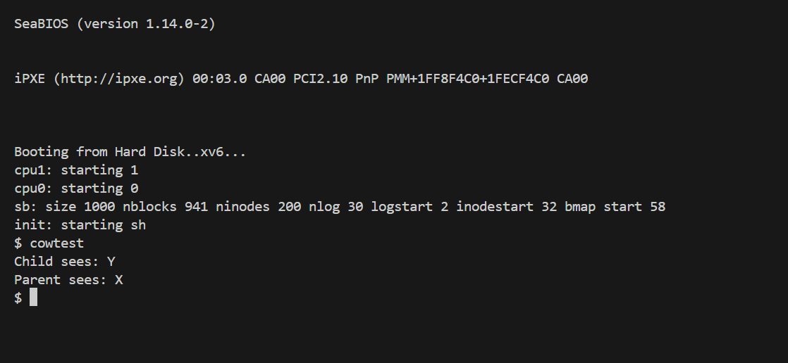
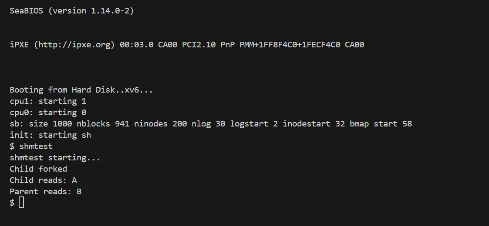

# 📝 Laporan Tugas Akhir

**Mata Kuliah**: Sistem Operasi
**Semester**: Genap / Tahun Ajaran 2024–2025
**Nama**: Radika Rismawati Tri Prasaja
**NIM**: 240202905
**Modul yang Dikerjakan**:
# 🧪 Modul 3 – Manajemen Memori Tingkat Lanjut (xv6-public x86)

## 📌 Deskripsi Singkat Tugas  
**Modul 3 – Manajemen Memori Tingkat Lanjut:**  
Mengimplementasikan dua fitur memori tingkat lanjut di kernel xv6:  

- **Copy-on-Write (CoW)** pada `fork()` untuk meningkatkan efisiensi duplikasi memori proses.  
- **Shared Memory ala System V** menggunakan dua system call baru: `shmget()` dan `shmrelease()` untuk memungkinkan proses saling berbagi halaman memori secara aman.

---

## 🛠️ Rincian Implementasi  

### A. Implementasi Copy-on-Write (CoW)  
- Menambahkan array `ref_count[]` di `vm.c` untuk menghitung referensi halaman fisik.  
- Membuat fungsi `incref()` dan `decref()` untuk manajemen reference count.  
- Menambahkan flag `PTE_COW` di `mmu.h` sebagai penanda halaman Copy-on-Write.  
- Membuat fungsi `cowuvm()` sebagai pengganti `copyuvm()` di `vm.c`.  
- Mengubah `fork()` di `proc.c` agar menggunakan `cowuvm()` saat menduplikasi proses.  
- Menambahkan handler untuk page fault (`T_PGFLT`) di `trap.c` untuk menangani penulisan pertama (lazy copy).  

### B. Implementasi Shared Memory  
- Menambahkan struktur `shmtab[]` di `vm.c` untuk menyimpan informasi shared memory per key.  
- Mengimplementasikan syscall `shmget()` dan `shmrelease()` di `sysproc.c`.  
- Registrasi system call di:  
  - `syscall.h`  
  - `user.h`  
  - `usys.S`  
  - `syscall.c`  

---

## ✅ Uji Fungsionalitas  

Program uji yang digunakan:  
- `cowtest`: untuk menguji Copy-on-Write saat fork  
- `shmtest`: untuk menguji fungsi `shmget()` dan `shmrelease()` pada shared memory  

---

## 📷 Hasil Uji  

### 📍 Hasil Output `cowtest`:  
```
Child sees: Y  
Parent sees: X
```


### 📍 Hasil Output `shmtest`:  
```
shmtest starting...  
Child forked  
Child reads: A  
Parent reads: B
```


---

## ⚠️ Kendala yang Dihadapi  
- Salah mapping flag `PTE_W` yang menyebabkan semua halaman CoW tetap writable dari awal (fixed dengan menghapus `PTE_W` dan menambahkan `PTE_COW`).  
- Terjadi panic saat page fault jika tidak menangani validasi `pte` dengan benar.  
- Lupa menambahkan `refcount` di `kalloc()` awal sehingga halaman tidak terbebas saat `decref()`.

---

## 📚 Referensi  
- MIT xv6 book: [https://pdos.csail.mit.edu/6.828/2018/xv6/book-rev11.pdf](https://pdos.csail.mit.edu/6.828/2018/xv6/book-rev11.pdf)  
- xv6-public: [https://github.com/mit-pdos/xv6-public](https://github.com/mit-pdos/xv6-public)  
- Diskusi dan dokumentasi praktikum  
- Stack Overflow, GitHub Issue, dan sumber terbuka lain terkait COW dan Shared Memory di xv6  

---

## ✅ Kesimpulan  
Pada modul ini, dua fitur penting sistem operasi berhasil diimplementasikan:

1. **Copy-on-Write (CoW)** membuat proses `fork()` lebih efisien dengan hanya menyalin halaman saat penulisan diperlukan (lazy copy).  
2. **Shared Memory** memungkinkan dua atau lebih proses saling mengakses satu area memori bersama untuk komunikasi antar-proses.

Modul ini memperdalam pemahaman tentang manajemen memori, page fault handling, dan efisiensi kernel xv6.


