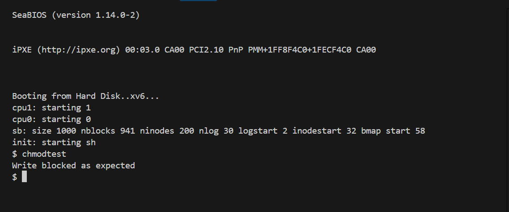
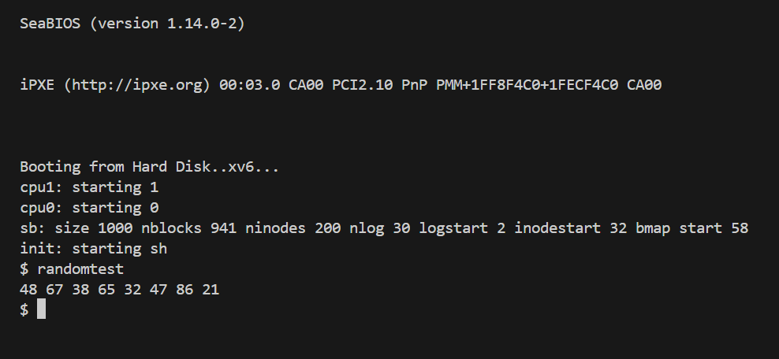

# 📝 Laporan Tugas Akhir

**Mata Kuliah**: Sistem Operasi
**Semester**: Genap / Tahun Ajaran 2024–2025
**Nama**: Radika Rismawati Tri Prasaja
**NIM**: 240202905
**Modul yang Dikerjakan**:
# 🧪 Laporan Praktikum Sistem Operasi – Modul 4

## 📌 Deskripsi Singkat Tugas

**Modul 4 – Subsistem Kernel Alternatif (xv6-public)**  
Pada modul ini, dilakukan dua modifikasi terhadap kernel xv6:
1. Menambahkan system call baru `chmod(path, mode)` untuk mengatur mode akses file secara sederhana (read-only atau read-write).
2. Menambahkan pseudo-device `/dev/random` yang menghasilkan angka acak saat dibaca.

---

## 🛠️ Rincian Implementasi

### ✳️ System Call `chmod()`
- Menambahkan field `mode` ke `struct inode` (pada `fs.h`).
- Menambahkan syscall baru di `syscall.h`, `user.h`, `usys.S`, `syscall.c`, dan `sysfile.c`.
- Menyesuaikan fungsi `filewrite()` di `file.c` agar menolak penulisan jika mode file adalah read-only.
- Membuat program uji `chmodtest.c` untuk memastikan file read-only tidak bisa ditulis kembali.

### ✳️ Device `/dev/random`
- Menambahkan file baru `random.c` berisi fungsi `randomread()` sebagai pembangkit byte acak.
- Mendaftarkan driver baru pada `devsw[]` di `file.c`.
- Membuat node device `/dev/random` di `init.c`.
- Membuat program uji `randomtest.c` untuk membaca 8 byte acak dari device tersebut.

---

## ✅ Uji Fungsionalitas

### Program Uji:
- `chmodtest`: menguji pembatasan tulis pada file read-only.
- `randomtest`: menguji pembacaan angka acak dari `/dev/random`.

---

## 📷 Hasil Uji

### 📍 Output chmodtest:
```
Write blocked as expected
```


### 📍 Output randomtest:
```
48 67 38 65 32 47 86 21
```


---

## ⚠️ Kendala yang Dihadapi

- Penempatan field `mode` awalnya dilakukan langsung ke disk layout yang menyebabkan error saat mounting fs lama. Solusinya, hanya digunakan di memori (volatile).
- Kesalahan pada pendaftaran `devsw[]` menyebabkan `/dev/random` gagal diakses sebelum diperbaiki indeksnya.

---

## 📚 Referensi

- Buku xv6: [https://pdos.csail.mit.edu/6.828/2018/xv6/book-rev11.pdf](https://pdos.csail.mit.edu/6.828/2018/xv6/book-rev11.pdf)
- xv6-public GitHub: [https://github.com/mit-pdos/xv6-public](https://github.com/mit-pdos/xv6-public)
- Modul Praktikum SO 2024 – Modul 4

---
